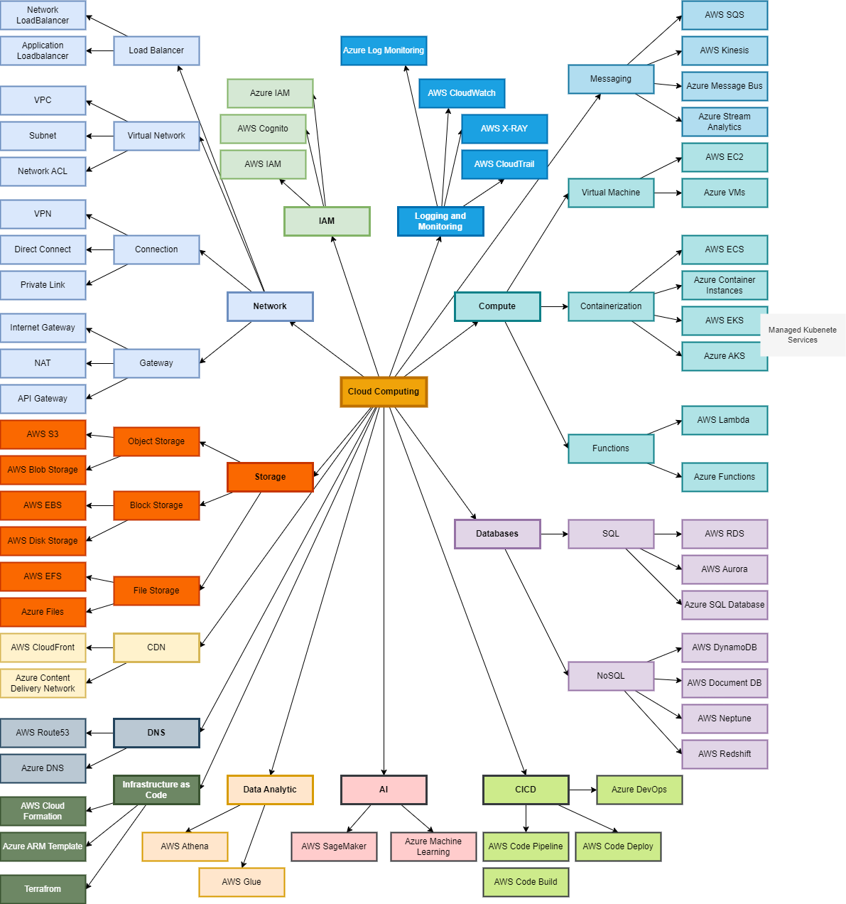
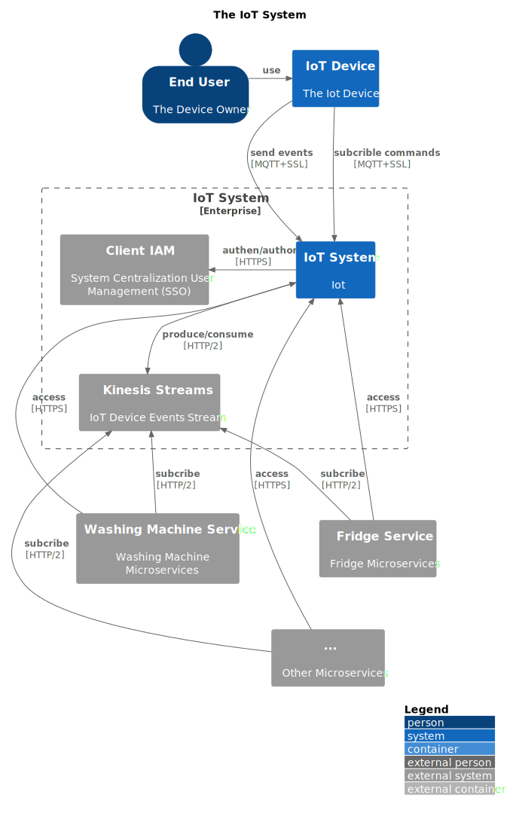
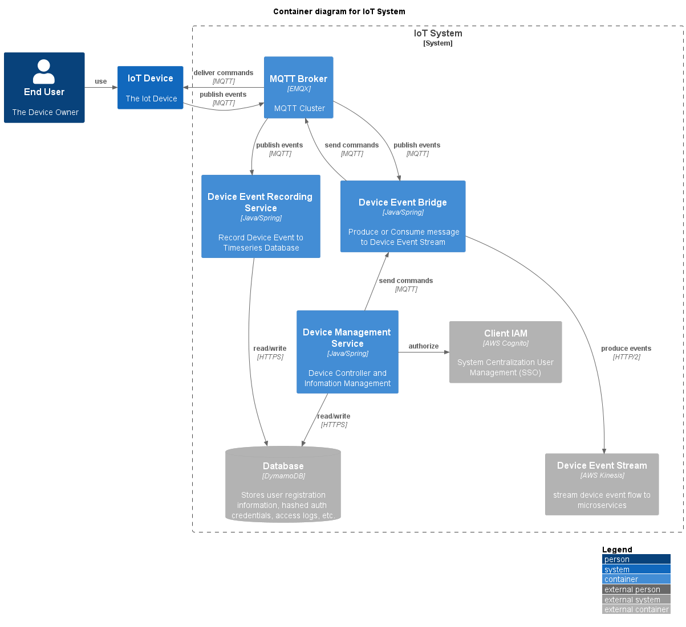
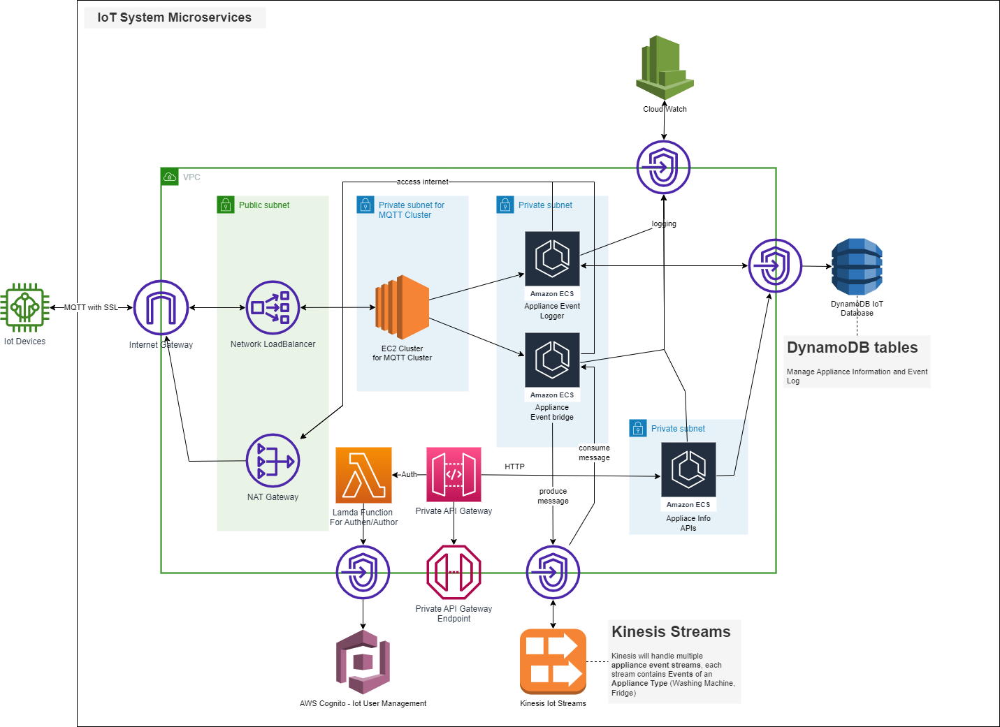
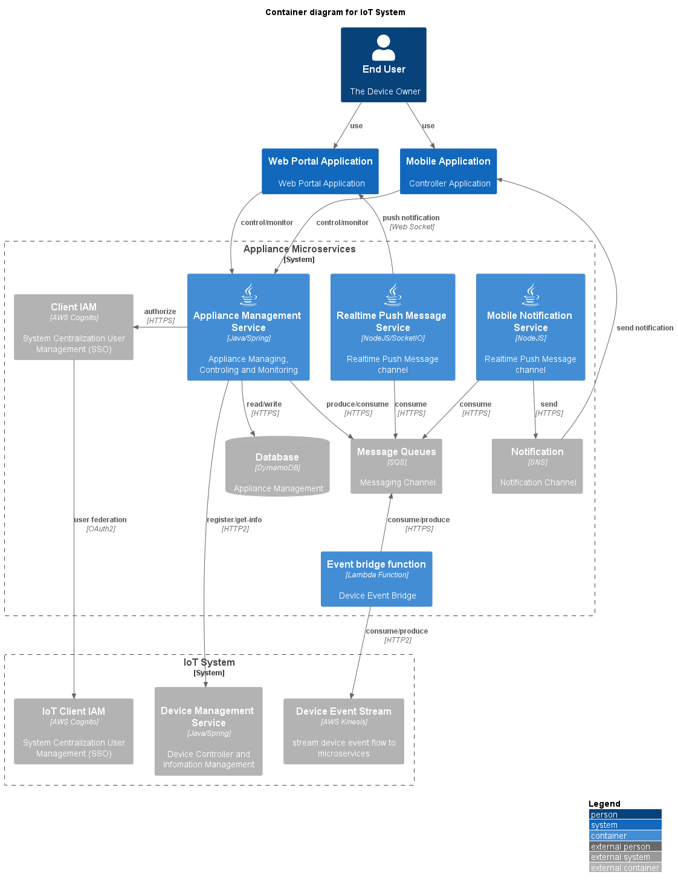
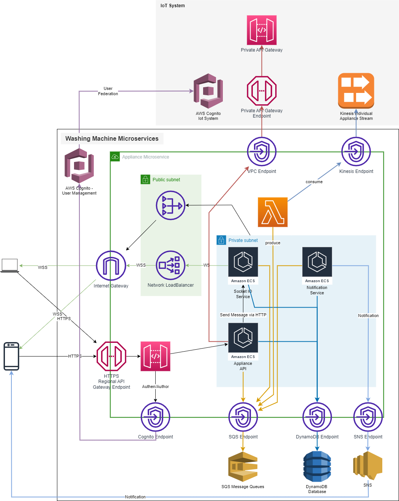

# Cloud Computing Introduction
Cloud Computing Introduction

## Agenda

- Story of Cloud Computing
  + Whats is Cloud Computing
  + History of Cloud Computing
  + Cloud Computing Providers
  + Cloud Computing Market
- Cloud Computing Concepts
  + The World before Cloud Computing
  + Cloud Computing Solution
  + Cloud Computing Service Types
  + Cloud Computing Common Services
- Cloud Computing Environments
  + Public Cloud
  + Private Cloud
  + Hybrid Cloud
  + Muliple Cloud
- Cloud Computing Examples
  + The IoT System
  + The Appliance Microservices

## Cloud Services

## Cloud Computing Examples

### The IoT System

#### Microservices and Components

#### Cloud Architecture Design

### The Appliance Microservices

#### Microservices and Components

#### Cloud Architecture Design

